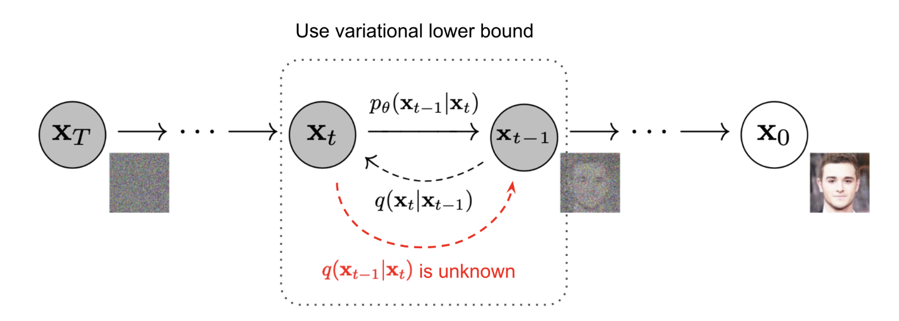
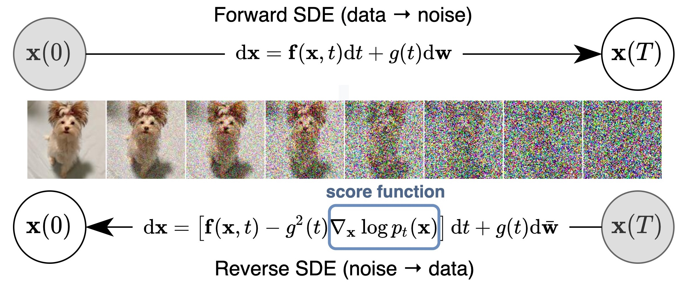
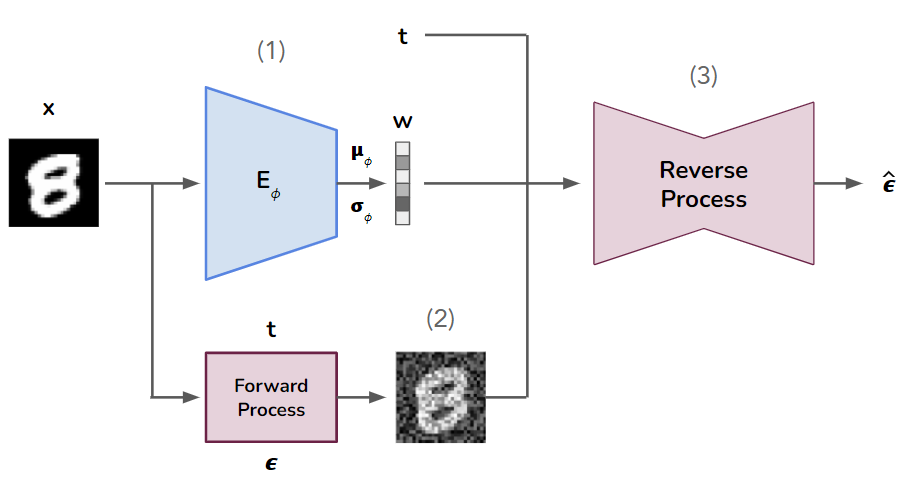
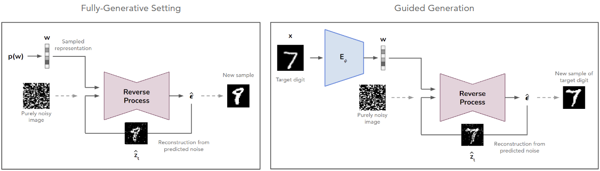
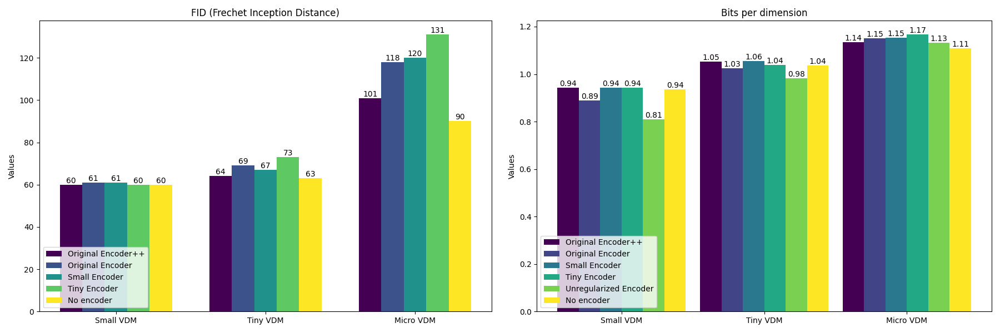
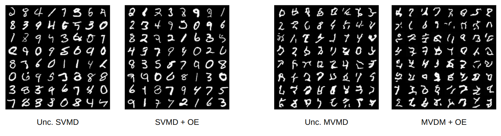
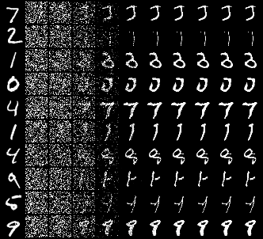
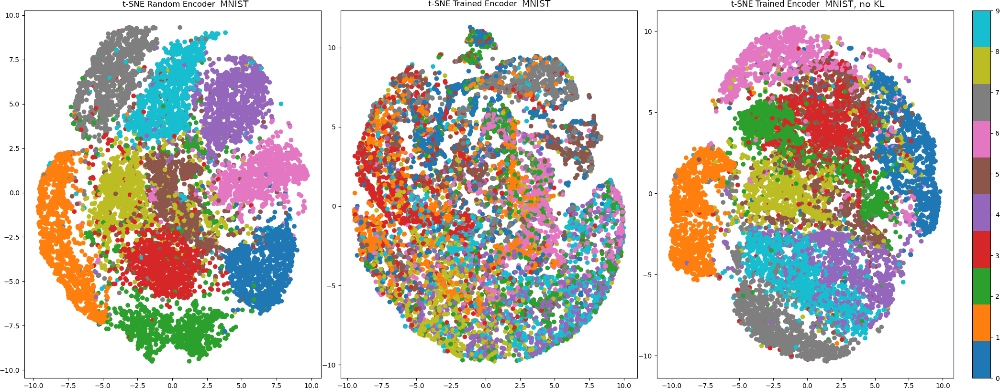
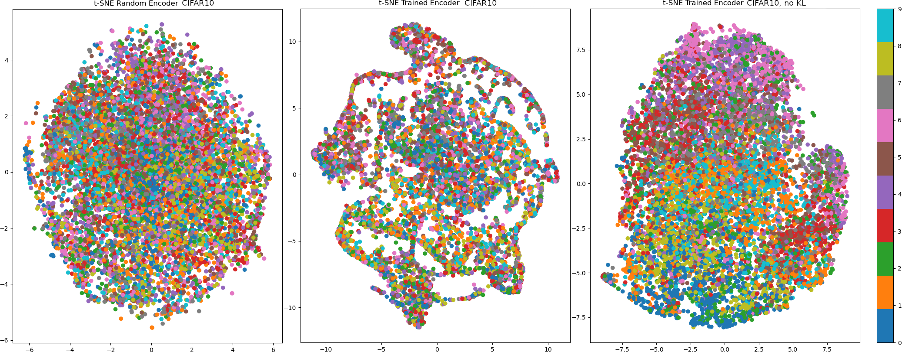

# Representation Learning with Variational Diffusion Models

by Diego Garcia Cerdas, Maks Kulicki, Egoitz Gonzalez, Jacky Chu

Project supervised by Samuele Papa for the course *Deep Learning II* at the University of Amsterdam. Code available in [our GitHub repository](https://github.com/diegogcerdas/VAE-VDM).

*This blog post introduces a method for representation learning using probabilistic diffusion models. Diffusion-based models have recently delivered impressive generative results across several domains, such as images, audio, and 3D shapes. However, their architecture does not typically include a module for capturing data representations.*

*Abstreiter et al. (2022) recently proposed a method for learning representations using a particular formulation of diffusion-based models. In their method, the data encodings are learned in an unsupervised manner and contain information needed for the denoising process.*

*Inspired by their work, we present a method for representation learning using a Variational AutoEncoder (VAE), where the decoder model is a (conditional) Variational Diffusion Model. This new formulation helps us leverage previous research on VAEs and, most importantly, describes a *fully-generative setting*.*

*We start by providing an introduction to generative modeling, VAEs, and diffusion-based models. We then delve into the study conducted by Abstreiter et al., which focuses on diffusion-based representation learning, while analyzing the strengths and weaknesses of their work. Following that, we present our own approach, detailing the experimental setup and share our results. To conclude, we discuss the optimization challenges we encountered during our research and provide a summary of our findings.*

## Introduction 

### Generative Modeling

Let’s assume we have a true underlying data distribution $p\_\text{data}(\mathbf{x})$, and a dataset $\mathcal{D}$ of i.i.d. samples from this distribution. Our goal is to learn a likelihood $p\_\theta(\mathbf{x})$ from $\mathcal{D}$ that closely resembles $p\_\text{data}(\mathbf{x})$, so that we can generate new data by sampling from it.

One way to learn $p\_\theta(\mathbf{x})$ is through Maximum Likelihood Estimation (MLE), where the objective is to find the optimal parameters $\theta$ according to:

$$\underset{\theta}{\mathrm{max}} \\;\mathbb{E}\_{p\_\text{data}(\mathbf{x})}[\log p\_\theta(\mathbf{x})],$$

where the expectation is approximated using a sample average over $\mathcal{D}$.

In practice, exactly-computing $p\_\theta(\mathbf{x})$ is typically an intractable quantity due to the normalization constant. To enable maximum likelihood training, likelihood-based models face the challenge of either constraining their model architectures to make the computations feasible, or approximating the normalizing constant at the cost of computational complexity. We continue by discussing some of these approaches below. 

#### Latent Variable Models

In general, we are also interested in modeling the *factors* $\mathbf{w}$ in data that are crucial for generating an object. Once modeled, these factors can be used as a *representation* of the original data.

Latent variable models introduce the generative process $p\_\theta(\mathbf{x,w}) = p\_\theta(\mathbf{x|w})p(\mathbf{w})$, where

- $p(\mathbf{w})$ is a *prior distribution* over the latent variables, and
-  $p\_\theta(\mathbf{x|w})$ is the *conditional distribution*, parameterized by $\theta$.

Since only $\mathbf{x}$ is accessible during training, we marginalize out the latent variables $\mathbf{w}$ to obtain the likelihood of the data:
$$p\_\theta(\mathbf{x}) = \int\_\mathbf{w} p\_\theta(\mathbf{x|w})p(\mathbf{w})d\mathbf{w}.$$

If we want to know how probable a representation $\mathbf{w}$ is for given data $\mathbf{x}$, we are interested in the *posterior distribution*:
$$p\_\theta(\mathbf{w|x}) = p\_\theta(\mathbf{x|w})p(\mathbf{w})/p\_\theta(\mathbf{x}).$$
But here we face the same problem as above: the integral over $\mathbf{w}$ is typically intractable, which makes exact likelihood computation unfeasible. 

### Variational AutoEncoders

Variational AutoEncoders were first proposed by ([Kingma and Welling 2014](https://arxiv.org/abs/1312.6114)). They are a type of latent variable model that uses *variational inference* () to approximate the likelihood, thus alleviating the problem encountered above. More specifically, VAE describes a probabilistic encoder-decoder architecture where:

- The encoder is defined by the *variational posterior* $q\_\phi(\mathbf{w|x})$, which is parameterized by a neural network.
- The decoder is defined by the *conditional distribution* $p\_\theta(\mathbf{x|w})$, which is parameterized by another neural network.

The network parameters $\phi$ and $\theta$ can be jointly optimized by maximizing the variational lower bound (VLB) on the log-likelihood:
$$ \log p\_\theta(\mathbf{x}) \geq \mathbb{E}\_{\mathbf{w} \sim q\_\phi(\mathbf{w|x})} \left[\log p\_\theta(\mathbf{x|w})\right] - D\_\text{KL}(q\_\phi(\mathbf{w|x}) || p(\mathbf{w}))
    = -\mathcal{L}\_{VAE}.$$
Here, the first term of the loss is a reconstruction term measuring how much the reconstructed data resembles the input. The second term is a regularization term that encourages the learned approximate posterior to be close to the prior distribution, thus enforcing latent space regularity and exploration.

The probabilistic nature of VAEs facilitates the exploration of the latent space and the generation of diverse and novel outputs. The success of VAEs in representation learning can be attributed to their ability to disentangle underlying factors of variation and capture complex dependencies in the data, enabling them to learn meaningful and interpretable representations, but they are often subject to producing blurry images that is often associated with the simplified distribution assumption . Diffusion models, on the other hand, are known to produce high-quality samples, we briefly discuss them in the next section.

### Diffusion-based Models

Diffusion-based models are another type of deep generative model that has gained significant attention recently for their ability to generate diverse, high-resolution samples with exceptional fidelity (,). Intuitively, they decompose the generative process into many "denoising steps".

More specifically, a diffusion-based model can be dissected into a *forward diffusion process* and a *reverse diffusion process*. 

- The forward process gradually adds noise to samples from the data distribution $p\_\text{data}(\mathbf{x})$, until the perturbed samples lose all the information they originally contained.
- The reverse process is a neural network that learns to reverse the noising process, in order to effectively generate new data samples. 

Two alternative formulations of diffusion-based modeling have been proposed and thoroughly researched: *diffusion probabilistic models* and *score-based generative models*. Although they were motivated independently, they share many connections under the right assumptions (). Let's take a closer look at each of them.

(*For a complete introduction to diffusion-based models, we recommend [this blog post by The AI Summer](https://theaisummer.com/diffusion-models/)*). 

#### Formulation 1: Diffusion Probabilistic Models

One way to look at diffusion-based models is as latent variable models. [Diffusion probabilistic models (DPMs)](https://arxiv.org/abs/1503.03585) first introduced this setting, where-after many extensions and improvements have been published (,). 

For the forward diffusion process, let us assume the real data distribution to be $q(\mathbf{x})$ from which we can sample a data point (image), $\mathbf{x}\_0 \sim q(\mathbf{x})$. We can then define the forward diffusion process as
$$
q(\mathbf{x}\_t \vert \mathbf{x}\_{t-1}) = \mathcal{N}(\mathbf{x}\_t; \sqrt{1 - \beta\_t} \mathbf{x}\_{t-1}, \beta\_t\mathbf{I}) \quad
q(\mathbf{x}\_{1:T} \vert \mathbf{x}\_0) = \prod^T\_{t=1} q(\mathbf{x}\_t \vert \mathbf{x}\_{t-1}) $$ where at each time step $t$, the data is updated by adding some Gaussian noise, producing a gradually noisier sequence of samples $\mathbf{x}\_1, ..., \mathbf{x}\_T$, where $\mathbf{x}\_T$ equals an isotropic Gaussian distribution as $T \to \infty$. Hence, at every time step $t$, we can draw  from the conditional Gaussian distribution a new sample $\mathbf{x}\_t=\sqrt{1-\beta\_t} \mathbf{x}\_{t-1}+\sqrt{\beta\_t} \epsilon$. 

By defining the forward process as above,  [Sohl et al. 2015](https://arxiv.org/abs/1503.03585) have shown that we do not need to repeatedly draw from the distribution $q$ to reach a certain sample $\mathbf{x}\_t$. This formulation is given by:
$$
    q(\mathbf{x}\_t \vert \mathbf{x}\_0) = \mathcal{N}(\mathbf{x}\_t; \sqrt{\bar{\alpha}\_t} \mathbf{x}\_0, (1 - \bar{\alpha}\_t)\mathbf{I})
$$
where we let $\alpha\_t = 1 - \beta\_t$ and $\bar{\alpha}\_t = \prod\_{i=1}^t \alpha\_i$. This provides us with to have the flexibility to sample $\mathbf{x}\_t$ at any desired noise level, given the condition of $\textbf{x}\_0$.

The strength of the noise is controlled by a variance scheduler $\{\beta_t \in (0, 1)\}_{t=1}^T$. The variance scheduler, can take on various forms to define the relationship between the $\beta$s and subsequently impacts the performance of the diffusion process .  

Now that we have defined the forward process, how can we reverse this process? If we can access the conditional distribution $p(\mathbf{x}\_{t-1} | \mathbf{x}\_t)$, it would be possible to reverse the diffusion process. Simply by sampling random Gaussian noise $\mathbf{x}\_T \sim \mathcal{N}(\mathbf{0},\mathbf{I})$ and iteratively denoising it, would give us the possibility to obtain a sample $\mathbf{x}\_0$ from the true distribution. The conditional distribution $p(\mathbf{x}\_{t-1} | \mathbf{x}\_t)$ is, however, in most cases intractable due to its dependency on the entire dataset. 

Therefore, in order to run the reverse diffusion process effectively, it becomes essential to learn a suitable model that can approximate the conditional probabilities. These conditional probabilities play a crucial role in understanding how the data evolves during the diffusion process. By learning a model denoted as $p\_\theta$, where 
$\theta$ represents the model's parameters, we aim to capture the intricate relationships and dependencies within the data. 

The reverse diffusion process can be denoted as: 
$$
    p\_\theta(\mathbf{x}\_{0:T}) = p(\mathbf{x}\_T) \prod^T\_{t=1} p\_\theta(\mathbf{x}\_{t-1} \vert \mathbf{x}\_t) \quad
p\_\theta(\mathbf{x}\_{t-1} \vert \mathbf{x}\_t) = \mathcal{N}(\mathbf{x}\_{t-1}; \boldsymbol{\mu}\_\theta(\mathbf{x}\_t, t), \boldsymbol{\Sigma}\_\theta(\mathbf{x}\_t, t))
$$
The detailed diffusion processes can be seen schematically below:

<em>Schematic depiction of the Markov chain of forward and reverse diffusion process. Showing how we can sample from $\mathbf{x\_T}$ (complete isotropic noise) to an image $\mathbf{x\_0}$ from the real data distribution. Image source: [DDPMs](https://arxiv.org/abs/2006.11239).</em>

Thus, assuming that our model $p\_\theta$ follows a Gaussian distribution, it is tasked with learning the mean and variance parameterized by $\mu\_\theta$ and variance $\Sigma\_\theta$, respectively. 

In literature there are different approaches as to what to do with the variance. Traditional approaches would set the variance to $\Sigma\_\theta(\mathbf{x\_t}, t) = \sigma\_{t}^{2}\mathbf{I}$. [Nichol et al. (2021)](https://arxiv.org/abs/2102.09672) proposed a novel approach where the model itself learns the optimal variance values during the denoising phase. This departure from traditional approaches, resulted in significant improvements in the obtained results.

The idea behind this is that when enabling the model to learn the variance, it gains the flexibility to adapt and adjust the noise reduction process based on the specific characteristics of the data. This dynamic learning of variance allows for a more fine-grained control of the denoising process, leading to enhanced performance and improved results.

[Variational Diffusion Models (VDMs)](https://arxiv.org/abs/2107.00630) build upon DPMs to achieve state-of-the-art likelihood approximation. They describe an architecture based on [hierarchical VAEs](https://arxiv.org/abs/1602.02282), and define a sequence of increasingly noisy versions of the data $\mathbf{x}$ represented by the latent variables $\mathbf{z}\_t$, where $t = 0$ is the least noisy version and $t = 1$ is the noisiest version. By analyzing the variational lower bound:
$$-\log p\_\theta(\mathbf{x}) \leq  \underbrace{D\_\text{KL}[q(\mathbf{z}\_1|\mathbf{x})||p(\mathbf{z}\_1)]}\_{\text{Prior loss}} + \underbrace{\mathbb{E}\_{q(\mathbf{z}\_{0}|\mathbf{x})}[-\log p\_\theta(\mathbf{x}|\mathbf{z}\_0)]}\_{\text{Reconstruction loss}} + \underbrace{\sum\_{i=1}^T \mathbb{E}\_{q(\mathbf{z}\_{t(i)}|\mathbf{x})}D\_\text{KL}[q(\mathbf{z}\_{s(i)}|\mathbf{z}\_{t(i)}, \mathbf{x})||p\_\theta(\mathbf{z}\_{s(i)}|\mathbf{z}\_{t(i)})]}\_{\text{Diffusion loss}},$$
where $s(i) = (i-1)/T, t(i)=i/T$ for finite $T$, they derive a remarkably simple loss $L\_{VDM}$.

#### Formulation 2: Score-based Generative Models

[Score-based models](https://arxiv.org/abs/1907.05600) $s\_\theta(\mathbf{x})$ sidestep the difficulty of intractable likelihood computation by modeling the *score function* $\nabla\_\mathbf{x} \log p(\mathbf{x})$ of the data distribution (). Langevin dynamics provides a procedure to sample from the data distribution once the score-based model is trained.

However, a new difficulty arises when estimating the score in regions with low probability density. To counteract this, data points are perturbed with noise, so that low-density areas are populated. Using multiple noise scales is beneficial for the model, as it learns the score for different amounts of signal remaining in the perturbed data (Song et al.)[https://arxiv.org/abs/2006.09011].

By generalizing the number of noise scales to infinity, the noise perturbation procedure can be represented by a stochastic differential equation (SDE). We can then reverse the perturbation process by using the reverse SDE.

<em>Forward and reverse diffusion processes for a score-based model represented as an SDE. Image by [Yang Song](https://yang-song.net/blog/2021/score/#connection-to-diffusion-models-and-others).</em>

Training a score-based model $s\_\theta(\mathbf{x})$ to approximate the true score function $\nabla\_\mathbf{x} \log p(\mathbf{x})$ can be done through [Explicit Score Matching (ESM)](https://www.jmlr.org/papers/volume6/hyvarinen05a/hyvarinen05a.pdf):
$$J^{ESM} = \mathbb{E}\_{\mathbf{x}\_t}\left[\|s\_\theta(\mathbf{x}\_t, t) - \nabla\_{\mathbf{x}\_t} \log p(\mathbf{x}\_t)\|\_2^2\right].$$

However, since the true score function is generally unknown, one can apply [Denoising Score Matching (DSM)](https://www.iro.umontreal.ca/~vincentp/Publications/smdae_techreport.pdf):
$$J^{DSM} = \mathbb{E}\_{t}\mathbb{E}\_{\mathbf{x}\_0}\mathbb{E}\_{\mathbf{x}\_{t|0}}\left[\lambda(t)\|s\_\theta(\mathbf{x}\_t, t) - \nabla\_{\mathbf{x}\_t} \log p(\mathbf{x}\_t|\mathbf{x}\_0)\|\_2^2\right],$$
where $\lambda(t)$ is a time-dependent constant.

*For more details on score-based generative models, see [this blog post by Yang Song](https://yang-song.net/blog/2021/score/#connection-to-diffusion-models-and-others)*.

## Diffusion-based Representation Learning

Now that we have covered the basic concepts needed for the rest of the blog post, let's dive into representation learning with diffusion-based models. An important thing to notice beforehand is that the architecture of diffusion-based models does not typically include a module for capturing data representations.

[Abstreiter et al. (2022)](https://arxiv.org/abs/2105.14257) look at diffusion-based methods represented as stochastic differential equations on a continuous-time domain (i.e., *Formulation 2* as defined above), and leverage them for learning representations in an unsupervised manner. 

Since this setting relies on denoising score matching, they present a new (conditional) formulation of the DSM objective. Here, the score-based model $s\_\theta$ takes as additional input the encoding $E\_\phi(\mathbf{x}\_0)$:
$$J^{D R L} =\mathbb{E}\_{t, \mathbf{x}\_0, \mathbf{x}\_t}\left[\lambda(t)\left\|s\_\theta\left(\mathbf{x}\_t, t, E\_\phi(\mathbf{x}\_0)\right)-\nabla\_{\mathbf{x}\_t} \log p\left(\mathbf{x}\_t | \mathbf{x}\_0\right)\right\|\_2^2\right].$$

The authors explain that $E\_\phi(\mathbf{x}\_0)$ learns to extract the information from $\mathbf{x}\_0$ in a lower-dimensional space that helps recover $\mathbf{x}\_0$ by denoising $\mathbf{x}\_t$. 

They also show that, if all information about $\mathbf{x}\_0$ is contained in the representation $z$, then the objective can be reduced to zero. If there is no mutual information, the objective can only be reduced to a constant $$\|\nabla\_{\mathbf{x}\_t} \log p(\mathbf{x}\_t | \mathbf{x}\_0) - \nabla\_{\mathbf{x}\_t}\log p(\mathbf{x}\_t)\|\_2^2.$$ 

This justifies the use of the alternative objective for the purpose of representation learning.

The paper shows the following strengths:

- The formulation of $J^{DRL}$ in the context of denoising score matching provides a strong justification for its use in representation learning.
- The authors explain how the level of granularity in the encoded features can be manually controlled by modifying the weighting function $\lambda(t)$. They also provide empirical evidence to support this hypothesis.
- The authors extend the idea to learn an *infinite-dimensional code* by conditioning the encoder on $t$. The new encoder $E\_\phi(\mathbf{x}\_0, t)$ leads to richer representation learning compared to other static representation learning methods.

- The obtained representations show great potential for downstream tasks and as a pretraining step for semi-supervised image classification.

However, it also shows some limitations:

- The proposed method does not describe a fully-generative setting, where the latent representation can be sampled from a prior in order to generate new samples. While the authors do mention an alternative objective $J^{VDRL}$ for this purpose, the paper lacks its derivation. This renders it difficult to analyze and implement.

- In general, the paper presents some ideas without elaborating on their significance or including their derivation. This makes the paper hard to grasp without additional background knowledge.

- The paper does not place the significance of representation learning into context, especially considering recent advances at the time. This makes it difficult for the reader to gauge the true significance of the
proposed methods.

## Our Approach

We have observed that the setting proposed by Abstreiter et al. does not define a fully-generative model, where the latent encoding could be sampled from a prior distribution. Moreover, we are interested in exploring representation learning with probabilistic diffusion models (i.e., *Formulation 1* as defined above). For these reasons, we introduce a new approach based on a VAE where the decoder model is a conditional VDM.

### VAE Formalization

(*Note: in the following, we only provide a high-level overview of our formalization. For complete details on the prescribed distributions and formula derivations, please refer to [`Supplement.pdf`](https://github.com/diegogcerdas/VAE-VDM/blob/main/Supplement.pdf) in [our GitHub repo](https://github.com/diegogcerdas/VAE-VDM)*).

In the following, we use the same notation as introduced in the Variational AutoEncoders section above. First of all, we make the following assumptions about the probabilistic encoder:

- The prior over the latent variables is the standard multivariate Gaussian $p\_\theta(\mathbf{w}) = \mathcal{N}(\mathbf{0,I})$.
- The variational posterior is a Gaussian distribution $q\_\phi(\mathbf{w|x}) = \mathcal{N}(\bm{\mu}\_\phi(\mathbf{x}), \bm{\sigma}\_\phi^2(\mathbf{x})\mathbf{I})$, and $\bm{\mu}\_\phi(\mathbf{x}), \bm{\sigma}\_\phi^2$ are the outputs of a neural network encoder $E\_\phi$.

Then, we define the probabilistic decoder $p\_\theta(\mathbf{x|w})$ to be parameterized by a Variational Diffusion Model $D\_\theta$ conditioned on the latent variables $\mathbf{w}$. We parameterize the reverse process with a noise prediction model $\hat{\bm{\epsilon}}\_\theta(\mathbf{z}\_{t}, \mathbf{w};t)$ implemented as a U-Net [Ronneberger et al.](https://arxiv.org/abs/1505.04597). The network's task is to predict the noise added to the data at each timestep.

Combining the loss functions for VAE and VDM, we obtain the following objective:
$$\mathcal{L}\_{VAE'} =  \mathbb{E}\_{\mathbf{w} \sim q\_\phi(\mathbf{w|x})}\mathcal{L}\_\text{VDM} + D\_\text{KL}(q\_\phi(\mathbf{w|x}) || p(\mathbf{w})).$$
This can be seen as a typical VAE loss, where the reconstruction term (first term on the right-hand side) is the expectation of the VDM loss over all embeddings $\mathbf{w}$.

The result is the following: during training, an input image $\mathbf{x}$ passes through the encoder, yielding a representation $\mathbf{w}$ (1); for each timestep $t$, the forward diffusion process of the VDM applies noise $\epsilon$ to produce $\mathbf{z}\_t$ (2); the reverse diffusion process (implemented as a UNet) takes as input $\mathbf{w}$, $\mathbf{z}\_t$, and the time information $t$; it then outputs the noise $\hat{\bm{\epsilon}}$ (3) which should be close to $\epsilon$.

<em>Schematic of the VAE-VDM architecture</em>

After training, the reverse process starts from a purely-noisy image and iteratively denoises it until we obtain a sample of the data distribution. At every denoising step, it receives the representation $\mathbf{w}$, which can either be sampled from the prior over the latent variables (*fully-generative setting*) or encoded from a test image for which we want to generate similar samples (*guided generation*).

<em>Different generation strategies offered by our model.</em>

### Hypotheses

Now that we have formally defined our representation learning method, we want to investigate its potential. To this end, we formulate the following hyptotheses:

- **Is the encoder learning a *meaningful* representation of the data?**

    We expect the latent embedding $\mathbf{w}$ to encode global information of the input image $\mathbf{x}$, leading to representations that are meaningful and interpretable.

- **Is the representation *useful* for the diffusion-based model?**

    We expect the diffusion model to benefit from the information obtained from the embedding $\mathbf{w}$ at every denoising step. Since the noisy input $\mathbf{z}_t$ contains increasingly less information about $\mathbf{x}$ as we go forward in time, we expect the diffusion model to rely more heavily on $\mathbf{w}$ for later timesteps than for earlier ones.

## Experiments

In order to obtain an answer to the questions presented above, we first observe that the Variational Diffusion Model used as a decoder must be powerful enough to fit well to the data, but not too powerful to completely ignore the latent embedding. This observation comes from previous research on the information preference property of VAEs (,). We expect this setting to allow the encoder to learn good representations that are useful for the decoder.

With this in mind, we train encoders and VDMs of different sizes, and evaluate the performance of all combinations. We also evaluate unconditional VDMs (i.e. without an encoder) as a baseline.

This experimental setup allows us to also investigate the relative importance of the two networks: is a larger VDM with a small encoder preferred over a small VDM with a larger encoder?

We design the experiments for the MNIST dataset. Additionally, we repeat a subset of them on the CIFAR10 dataset, in order to get better qualitative insights.

### Architectures Considered

The following tables present the different encoder and VDM variants used in our experiments. 

The original VDM configuration comes from the [VDM paper](https://arxiv.org/abs/2107.00630). Due to the simplicity of MNIST, we did not train this model but only 3 scaled-down versions. The networks are scaled using the number of Resnet+Attention blocks in the U-Net of the VDM, and the number of channels in each block.

The encoder employed is based on the configuration from the [diffusers library](https://github.com/huggingface/diffusers/blob/main/src/diffusers/models/vae.py). Our versions are scaled down in both width (number of channels) and depth (layers per block) compared to the original. We included an alternative (OE++), which only differs from the original encoder by the increased size of the output embedding. After initial tests, we observed a common phenomenon in VAEs: potential posterior collapse (Wang et al. 2021)[https://openreview.net/pdf?id=ejAu7ugNj_M]. Therefore, we include experiments adjusting the original encoder that is trained without the regularization KL loss term on the encoder, allowing us to investigate the learned embeddings. However, we note that the full generative setting is loose here, since the approximated posterior is no longer regularized to enforce a meaningful latent space. 

The existing VDM code already implements U-Net conditioning on a time embedding. We added our custom $\mathbf{w}$ conditioning by concatenating it to the time embedding and inputting it to the U-Net. We made sure that the size of the $\mathbf{w}$ embedding is not small enough to be shadowed by the time conditioning.

We used the following naming notation for the different architectures for the ablation study: Small VDM (SVDM), Tiny VDM (TVDM), Micro VDM (MVDM) for the VDM sizes; Original Encoder (OE), Small Encoder (SE), Tiny Encoder (TE), Bigger OE (OE++), Unregularized Encoder (UE) for the encoder sizes.

#### Table 1: Different architectures for the encoder model
|                       | OE++ | OE | SE | TE |
|-----------------------|-------------|----------------------|--------------------|--------------------|
| Block output channels | 64          | 64                   | 32                 | 16                 |
| Layers per block      | 2           | 2                    | 1                  | 1                  |
| norm\_num\_groups       | 32          | 32                   | 16                 | 8                  |
| Latent encoding size  | 256         | 128                  | 128                | 128                |
| Parameter count       | 716,481           | 515,521              | 261,793            | 216,529            |

#### Table 2: Different architectures for the VDM model

|                   | Original VDM (Not used) | SVDM | TVDM | MVDM |
|-------------------|---------------------|------------------|-----------------|------------------|
| n\_blocks         | 32                  | 16               | 8               | 4                |
| embedding\_dim    | 128                 | 64               | 32              | 16               |
| Parameter count   | 31,656,961          | 3,979,521        | 261,793         | 131,265          |

#### Evaluation Metrics

We evaluated the performance of the models using these metrics: 

1. Bits per dimension (BPD): The "dimension" refers to a dimension of the data space, and the "bits" refers to the amount of information required to encode samples from the model. Lower bits/dim means that the model requires fewer bits to encode the data, indicating a better fit to the data distribution.

2. Fréchet Inception Distance (FID): The FID is a measure of similarity between two datasets of images. The FID calculates the Fréchet distance between two multivariate Gaussians fitted to feature representations of the Inception network. The two Gaussians are fitted to represent the real and generated images respectively. A lower FID score indicates that the two datasets of images are more similar, or in other words, that the generated images are more similar to the real images.

3. KL-divergence between the prior over the latent encoding and the variational posterior, indicating the presence of posterior collapse.

## Results

### Metrics

Below is a table summarizing all obtained metrics on MNIST for the different models.

|                       | SVDM/OE++ | SVDM/OE | SVDM/SE | SVDM/TE | SVDM/UE | Unc. SVDM | TVDM/OE++ | TVDM/OE | TVDM/SE | TVDM/TE | TVDM/UE | Unc. TVDM | MVDM/OE++ | MVDM/OE | MVDM/SE | MVDM/TE | MVDM/UE | Unc. MVDM |
|-----------------------|-----------|---------|---------|---------|---------|-----------|-----------|---------|---------|---------|---------|-----------|-----------|---------|---------|---------|---------|-----------|
| BPD                   | 0.94309   | 0.88821 | 0.94194 | 0.94323 | 0.80847 | 0.93576   | 1.05371   | 1.02508 | 1.05534 | 1.03958 | 0.98145 | 1.03694   | 1.13523   | 1.15056 | 1.15433 | 1.16660 | 1.13258 | 1.10882   |
| FID                   | 60        | 61      | 61      | 60      | 154     | 60        | 64        | 69      | 67      | 73      | 193     | 63        | 101       | 118     | 120     | 131     | 187     | 90        |
| Encoder KL-divergence | 0         | 0       | 0       | 0       | -       | -         | 0         | 0       | 0       | 0       | -       | -         | 0         | 0       | 0       | 0       | -       | -         |

We begin by noting that the KL-divergence drops to zero for all experiments. Given the rest of the results, this is an undesired behavior most likely caused by [*posterior collapse*](https://arxiv.org/abs/2301.00537). The VAE heavily relies on the reconstruction loss (here, the VDM loss) and does not effectively utilize the information in the latent space. Therefore, it minimizes the KL divergence term by equating the entire latent distribution to the prior. 

The following plots show the BPD and FID obtained from different combinations of VDM and encoder. The plots are grouped by the VDM size and colored by the encoder size, from largest to smallest model. It can clearly be seen that the VDM size is correlated with better performance. However, changes in the encoder result in no positive change in performance.  

<em>FID and BPD results of different combinations of VDM and encoder</em>

As our approximated posterior collapses to the fixed prior distribution for all experiments, meaning that it fails to effectively capture the underlying structure of the data, we conclude that given our approach and architectures the encoder is not able to learn a meaningful representation of the data, neither is it useful for the diffusion-based model. A more in-depth discussion and future work directions can be found in the discussion section.

## Sampling Results

For qualitative evaluation of the encoders and diffusion models, we chose to sample using the largest and smallest diffusion models: SVDM and MVDM respectively, and with the largest encoder (OE) or with no encoder at all. This way we can showcase the difference resulting from the size of the diffusion model, and from the presence of a powerful encoder.

We obtain sampling results that are in line with the obtained metrics. The SVDM generates realistic samples that correspond to real digits, though without any impact from the use of an encoder. 

In the case of the MVDM, most of the outputs do not correspond to actual digits and look like incomprehensible scribbles. This is likely due to the decreased power of the Variational Diffusion Model, resulting in an inability to correctly model the data distribution. We expected the encoder to be beneficial in this case, but also observe no qualitative improvement.

<em>Samples from trained SVDM and MVDM, with or without an encoder</em>

### Reconstructions

How do we confirm that the Variational Diffusion Model is not taking into account the latent representations received from the encoder? Starting from an image $\mathbf{x}$ from the test set, we show the reconstruction obtained using our architecture. 

The input image is first encoded into the representation $\mathbf{w}$. This is then fed to every step of the denoising process in the VDM: from pure noise up to a clean data sample. In the next figure, we show this reconstruction process for different input images.

<em>Reconstruction of samples. The first column is the original sample passed to the encoder. The second column is a purely noisy image. The rest of the columns are evenly distributed steps through the denoising process. The model used is TVDM/OE.</em>

The reconstructions show no resemblance between the encoded image and the reconstructed sample, which shows that the VDM model does not take into account the embedding during denoising. Without posterior collapse, we would expect the VDM to receive an embedding containing global features of the input image, and to use it during denoising to generate a sample that would contain the same digit.

## Learned Representations

In our first hypothesis, we explain that the encoder will ideally encode the data in a meaningful and interpretable manner. A structured and rich representation in the latent space would also be able to properly provide the denoising VDM the information necessary to recover the image. 

We visualize the resulting structure of that embedding space in a reduced 2-dimensional manifold using [T-distributed Stochastic Neighbor Embedding (t-SNE)](https://en.wikipedia.org/wiki/T-distributed_stochastic_neighbor_embedding) method to show qualitative results. We chose to show results using MVDM for training since the encoder has more responsibility in settings with a less powerful decoder.

<em>t-SNE plot of the output of the encoder on MNIST. The images correspond to randomly intilialized OE, OE trained with TVDM, UE(OE with no KL) trained with TVDM.</em>

For each of the images in the MNIST test set, we draw their corresponding point in the manifold of the latent space, colored with their ground truth labels. For a randomly initialized encoder, we already see some structure in the embedding space (left plot), due to the simplicity of the MNIST dataset. After we trained it with the VAE setting, we plot again the t-SNE (middle plot). We see that we no longer have the structure we had in the beginning. With this current setting, not only the network is not able to learn good representations but we also lose the initial structure we had. 

This unlikely behavior is also explained by the posterior collapse described above, which renders an uninformative posterior over the latent variables. Since t-SNE might not be representative of the data sometimes, we also computed PCA visualizations but we did not see different behavior.

To assess the effect of posterior collapse, we visualize the embeddings obtained from the corresponding unregularized encoder (UE) (right plot). As we expected, in this case, we didn't lose the structure we had at first. However, it is difficult to assess if the encoder is learning a meaningful representation or simply preserving the class separation already present during random initialization.

To further explore this, we also visualize the embeddings for the CIFAR10 dataset and TVDM. This dataset is more complex, so we no longer observe any structure in the randomly initialized latent space. When training without regularization (UE) the learned embedding starts to show some organization. Again, we do not see this happening for the regularized version.

<em>t-SNE plot of the output of the encoder on CIFAR10. The images correspond to randomly intilialized OE, OE trained with TVDM, UE(OE with no KL) trained with TVDM.</em>

These visualizations support the claim that a less powerful Variational Diffusion Model (derived from a more complex dataset) will likely rely on the information obtained from the encoder, and the latter has the potential to learn a meaningful embedding space when using a dataset that contains more diversity (CIFAR10 against MNIST).

## Discussion

The posterior collapse phenomenon encountered in our experiments arises when the decoder becomes overly powerful, learning to explain the data by itself without effectively utilizing the encoder's latent representation. As a consequence, the decoder focuses solely on equalizing the approximate posterior distribution with the prior distribution, disregarding the encoding step. This results in limited reconstruction quality and less meaningful latent representations.

The occurrence of posterior collapse highlights the importance of finding a balance between the capabilities of the decoder and the encoder in a VAE. In our case, the powerful VDM decoder dominated the learning process, hampering the ability of the encoder to capture meaningful latent representations. This limitation impacted the overall capability of our model to capture the complexity and nuances of the data distribution. 

Furthermore, the simplicity of the dataset used in our research may have contributed to the occurrence of posterior collapse. With a relatively simple dataset, the model may not have had sufficient incentive to learn highly meaningful latent representations. This lack of complexity in the data could have limited the exploration and utilization of the latent space, potentially exacerbating the issue of posterior collapse. To support this hypothesis we ran additional experiments to see whether using a more diverse dataset, like CIFAR10, would alleviate this problem. CIFAR-10 contains a wider variety of object classes and more complex images compared to the simpler handwritten digits in MNIST. By introducing more diversity and variability in the dataset, our VAE has a better chance of capturing the full range of variation and avoiding posterior collapse. This resulted in promising visualizations that the encoder is able to learn more meaningful representations, providing interesting continuation points. 

In terms of future work, there are several directions to consider. Firstly, exploring different and more diverse datasets like CIFAR10 would provide valuable insights into the behavior of the VAE with VDM decoder architecture. Complex and challenging datasets can present additional learning difficulties and shed light on the performance and limitations of the model in capturing intricate data distributions. Additionally, addressing posterior collapse could also involve investigating techniques specifically designed to cope with this challenge. Annealing the relative weight of the KL-divergence between the posterior and prior in the variational lower bound, architectural modifications, or alternative learning strategies can be explored to encourage a more balanced learning process between the encoder and the decoder, mitigating the occurrence of posterior collapse. 

During this study, time and resource constraints posed challenges in terms of data availability, computation power, and the ability to conduct extensive experiments. These limitations affected the exploration of larger and more diverse datasets and hindered the implementation of sophisticated techniques to address posterior collapse for us.

Despite these limitations, our research highlights the importance of understanding the interplay between the decoder's power, the encoder's capability, and the complexity of the dataset in VAE-based representation learning. By addressing posterior collapse and exploring techniques tailored to cope with this challenge, future research may unlock the full potential of the VAE with VDM decoder architecture: a truly generative model with diffusion-like quality sampling while capturing complex data distributions and generating meaningful representations.

## Conclusion

In this blog, we propose the use of a Variational Autoencoder (VAE) with a Variational Diffusion Model (VDM) decoder for representation learning. We explain that this setting offers promising opportunities in terms of sampling and data encoding. However, during our experimentation phase, we encountered a significant challenge known as posterior collapse, which can be attributed to the powerful nature of the VDM decoder.

We show several insights into this optimization challenge derived from our experimental results and provide a discussion about it. Most importantly, we emphasize the importance of understanding the interplay between the decoder's power, the encoder's capability, and the complexity of the dataset in VAE-based representation learning.

## Individual Contributions

Egoitz: Modified the existing VDM implementation to integrate with our changes in the architecture and evaluation. Ran experiments and developed code for visualizations. Worked on results analysis and discussion.

Diego: Developed VAE formalization and background theory. Debugged and ran experiments and visualizations. Worked on results analysis and discussion.

Jacky: Contributed in architectural approach of our experiments from a theoretical perspective. Ran experiments on the code for various models and worked on introduction, background, results and discussion.

Maks: Designed the experiments, ran some of them, visualized and reported the results. Helped with the code implementation. 

## References
